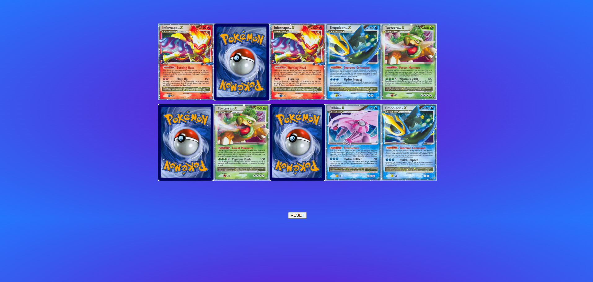

# Pokemon Card Memory Match

Link to project: (https://pokemonmemorymatch.netlify.app/)

## How It's Made:
Tech used: HTML, CSS, JS

A Pokemon-themed memory matching game, that allows users to click on a card and see its image to try and match it with another card that holds the same image. Every time two new cards are flipped, they are evalutated against each other to see if they match. If they do, they stay flipped - otherwise, they flip back over.

## Optimizations

This application has been optimized to ensure that correct pairs stay flipped when they have been matched. The also utilizes the setTimeout method that the browser API provides, to show the pictures on mismatched cards for a brief second before flipping them back over. This allows the users a chance to remember the location of cards later on.

## Lessons Learned

From this project, I learned that it can be useful to spread NodeLists into arrays to access the array methods. By doing this, I was able to use the filter method to only keep cards flipped if the most recently flipped pair matched each other.
